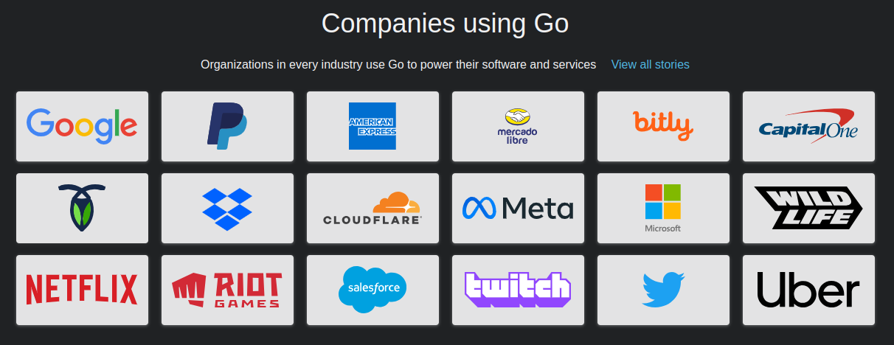

# 📖 1 - Introdução

## O que é a linguagem GO (Golang)

* Linguagem de programação open source que tem o objetivo de tornar os programadores mais produtivos
* Expressiva, concisa, limpa, e eficiente
* Foi criada para aproveitar ao máximo dos recursos multicore e de rede
* Rápida compilação e ao mesmo tempo trabalha com garbage collection
* Rápida, estaticamente típada, compilada mas que ao mesmo tempo parece até uma linguagem dinamicamente típada e interpretada

## Onde nasceu e quem criou?

* Google
* Começou a ser projetada em Setembro de 2007
* Versão 1.0 - 2012
* A partir da versão 1.5 - Próprio compilador foi feito em GO
* Retrocompatibilidade garantida
* Rob Pike - UNIX & UTF-8
* Robert Griesmar - V8
* Ken THompson - UNIX & UTF-8

## O que a linguagem GO não é?

* Uma linguagem de programação que resolverá todos os seus problemas
* Não é uma linguagem dinâmica
* Não é uma linguagem interpretada
* Não é uma linguagem com muitos recursos/firulas

## Quem usa GO?

<figure><figcaption></figcaption></figure>

## Motivação

* Suprir limitações em algumas linguagens utilizadas no mercado como Python,Java e C++
* Python: Problema com lentidão
* C/C++: Muita complexidade e demorado para compilar
* Java:  Complexidade gerado ao longo do tempo / Verbosidade da linguagem
* Multithreading e Concorrência: Não nasceram nativamente pensando nisso
* Simplicidade
* Framework de testes e profiling nativos
* Detecção de Race Conditions
* Deploy absurdamente simples
