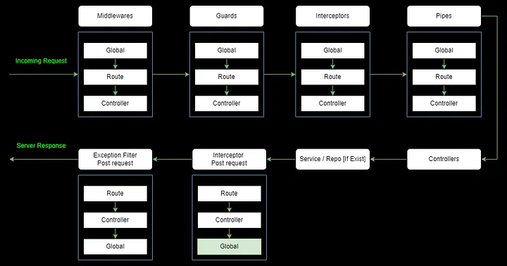

---
layout:
  title:
    visible: true
  description:
    visible: false
  tableOfContents:
    visible: true
  outline:
    visible: true
  pagination:
    visible: true
---

# Ciclo de vida de uma requisição

<figure><figcaption></figcaption></figure>
